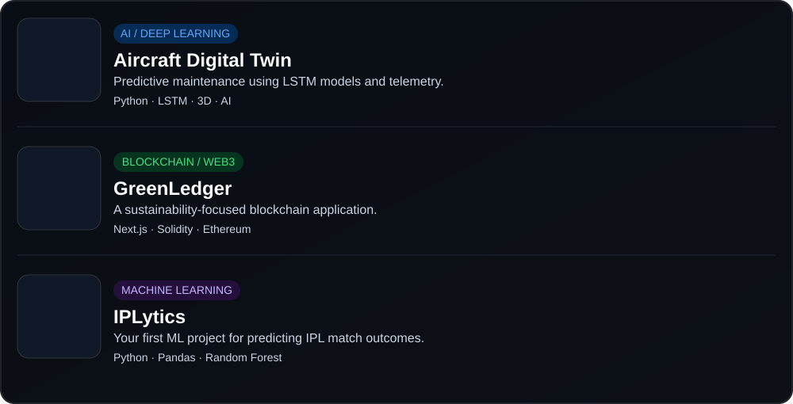

<div align="center">


</div>

</div>
## 🧑‍💻 About Me

```javascript
const devadarrsha = {
    education: "B.Tech Computer Science @ VIT Chennai",
    interests: [
        "Artificial Intelligence",
        "Machine Learning",
        "Blockchain",
        "Software Development"
    ],
    currentlyLearning: [
        "Deep Learning",
        "Artificial intelligence and machine learning",
        "System Design"
    ],
    goal: "Build intelligent and impactful software"
};
```

---
<h2 align="left"> Featured Projects</h2>

<p align="center">
  
</p>

---
<h2 align="left">GitHub Stats</h2>

<p align="center">
  
</p>

---
---

<h2 align="left">📈 Contribution Activity</h2>

<p align="center">
  
</p>

---
##  Currently Learning

* 🧠 Deep Learning
* 🤖 Neural Networks
* ⛓️ Blockchain
* 🗄️ Advanced SQL
* ⚙️ Backend Development
  
---

<h2 align="left">⚡ The Build Log</h2>

<p align="left">
  <i>From learning fundamentals to building intelligent systems.</i>
</p>

<table>
<tr>
<td width="50%" valign="top">

<h3>01 — Foundations</h3>


- Python Programming
- Data Science Fundamentals
- Machine Learning Basics
- First ML Project — IPLytics

</td>

<td width="50%" valign="top">

<h3>02 — Deep Learning</h3>


- Neural Networks
- Deep Learning
- LSTM Architectures
- Aircraft Engine Digital Twin

</td>
</tr>

<tr>
<td width="50%" valign="top">

<h3>03 — Intelligent Systems</h3>


- AI/ML Applications
- Blockchain Integration
- GreenLedger
- System Design

</td>

<td width="50%" valign="top">

<h3>04 — Next Target</h3>


- Production-ready AI/ML
- Advanced Model Development
- Scalable Backend Systems
- Build impactful software

</td>
</tr>
</table>

<p align="center">
  
</p>

---

## 💼 Experience

> As a computer science student, my experience comes from hands-on project building, competitive events, and workshops.

🏫 **VIT Chennai — Project Developer** · 2025–Present · Chennai, India

> Working on practical software projects involving AI/ML, blockchain, data science, and backend development.

---

## 📫 Connect With Me

📧 **Email:** [devadarrshaofficial@gmail.com](mailto:devadarrshaofficial@gmail.com)
💼 **LinkedIn:** [LinkedIn](https://www.linkedin.com/in/devadarrsha-p-d-81b64b3a4/)
🐙 **GitHub:** [GitHub](https://github.com/Devadarrsha-P-D)

---


