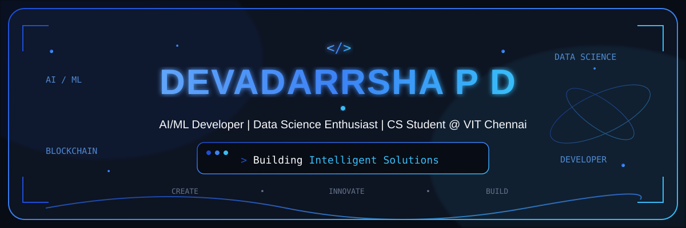

<div align="center">



</div>
</div>

---

🧑‍💻 About Me

```javascript
const devadarrsha = {
    education: "B.Tech Computer Science @ VIT Chennai",
    interests: [
        "Artificial Intelligence",
        "Machine Learning",
        "Blockchain",
        "Software Development"
    ],
    currentlyLearning: [
        "Deep Learning",
        "Artificial intelligence and machine learning",
        "System Design"
    ],
    goal: "Build intelligent and impactful software"
};
```
--- 
##  Featured Projects
 
<table>
<tr>
<td width="50%" valign="top">
<h3>🌿 GreenLedger</h3>
<p><strong>AI Energy & Carbon Optimization Platform</strong></p>
<p>Windows telemetry → XGBoost power prediction → carbon calculation → optimization → Green Credits + Web3 badge marketplace (Sepolia testnet).</p>
<p>
<code>Next.js</code> <code>FastAPI</code> <code>XGBoost</code> <code>Solidity</code> <code>Web3</code>
</p> 
</td>
<td width="50%" valign="top">
<h3> ⚙️ AeroGuard</h3>
<p><strong>Predictive Maintenance for Aircraft Engines</strong></p>
<p>Real-time anomaly detection + Remaining Useful Life (RUL) prediction + fault-based maintenance recommendations using NASA C-MAPSS data.</p>
<p>
<code>Python</code> <code>LSTM</code> <code>Random Forest</code> <code>SHAP</code>
</p>
</td>
</tr>
<tr>
<td width="50%" valign="top">
<h3>🛡️ The Relic Vault</h3>
<p><strong>Decentralized NFT Game Card Marketplace</strong></p>
<p>Mint, list, and trade unique high-fantasy game cards as NFTs on a blockchain testnet, complete with IPFS storage and cinematic mint reveals.</p>
<p>
<code>Solidity</code> <code>IPFS</code> <code>Web3</code> <code>Wallet Connect</code>
</p>
</td>
</tr>
</table>

---

##  Achievements
* 🏆 Won 2nd place overall at Recursion 2.0, a 24-hour hackathon organized by Microsoft Innovation Club, VIT Chennai
* 🤖 Built AI/ML and blockchain projects

---
<h2 align="left">GitHub Stats</h2>

<p align="center">
  
</p>

---
##  Currently Learning

* 🧠 Deep Learning
* 🤖 Neural Networks
* ⛓️ Blockchain
* 🗄️ Advanced SQL
* ⚙️ Backend Development
  
---

## 💼 Experience

> As a computer science student, my experience comes from hands-on project building, competitive events, and workshops.

🏫 **VIT Chennai — Project Developer** · 2025–Present · Chennai, India

> Working on practical software projects involving AI/ML, blockchain, data science, and backend development.

---

## 📫 Connect With Me

📧 **Email:** [devadarrshaofficial@gmail.com](mailto:devadarrshaofficial@gmail.com)
💼 **LinkedIn:** [LinkedIn](https://www.linkedin.com/in/devadarrsha-p-d-81b64b3a4/)
🐙 **GitHub:** [GitHub](https://github.com/Devadarrsha-P-D)

---
